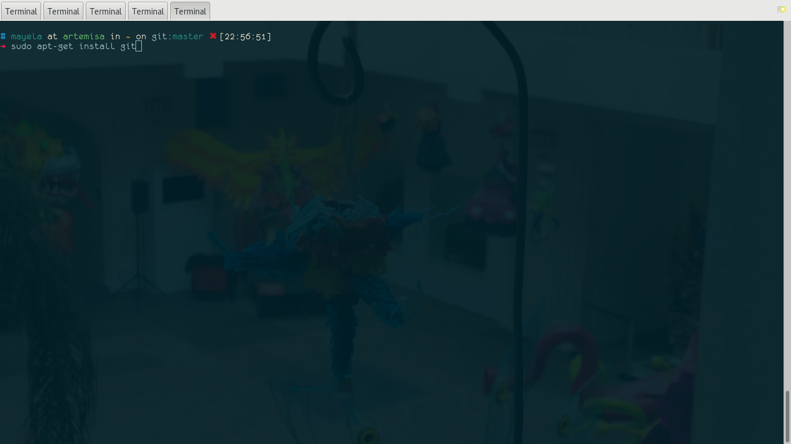

# Introducción a git


## ¿Qué es git?

Git es un sistema de control de versiones, esto quiere decir que es un sistema que nos permitirá llevar registro de los cambios en nuestro código y de cualquier tipo de archivo a través del tiempo, esto nos permitirá si lo deseamos regresar a alguna versión anterior de los mismos.

## Instalación de git

### Instalación de git en Linux

La instalación de git en sistemas Linux es muy sencilla solo debemos ir a la terminal y teclear el siguiente comando en sistemas basados en Debian:

            ```sudo apt-get install git```
            

            


